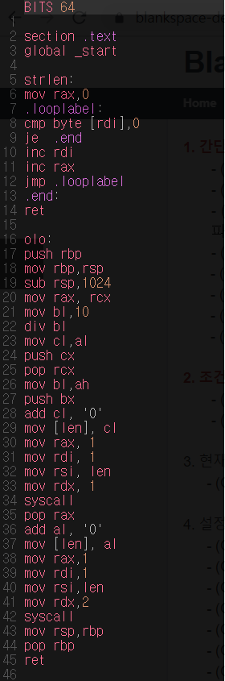

# HW-3

## 의문점 
2일차에 숙제로 내주신 strlen.asm에서 "hello"가 아닌 **더 긴 문자**을 넣으면 어떻게 출력이 될까??
### strlen.asm
```assembly

BITS 64

section .text

global _start

strlen:

    mov rax,0                 
.looplabel:
  
    cmp byte [rdi],0           
    je  .end                   
    inc rdi                     
    inc rax                   
    jmp .looplabel            
.end:

    ret                       
    
_start:

    mov   rdi, msg              
    call  strlen             
    add   al, '0'             
    mov  [len],al              
    mov   rax, 1               
    mov   rdi, 1             
    mov   rsi, len            
    mov   rdx, 2            
    syscall                    
    mov   rax, 60             
    mov   rdi, 0              
    syscall        

section .data

    msg db "hello",0x          
    len db 0,0xA 

```
---

## 사전 작업
1. 본래의 strlen.asm에서 "hello"가 넣어져 있지만, 뒤의 LF까지 글자 수로 포함해서 카운팅하기 때문에 '6'이 출력되었다. 하지만, 이는 글자 수를 카운팅하는 이 함수의 의도를 벗어났다고 판단하여 LF를 삭제했다. 따라서 "hello"가 넣어진 상태에서는 '5'가 출력이 된다.

  


---

2. 넣은 문자의 글자 수가 10~255(확장 아스키 코드 내의 범위)일 때 출력은 어떻게 될까?
- "You always pass failure on the way to success"를 넣었을 때 (글자 수 : 45)


> 45+48=93이다. 아스키코드 93은 ']'를 나타내기 때문에 ']'가 출력될 것이라고 예상했고, 실제로도 그랬다.

---

- "And whatever you do, whether in word or deed, do it all in the name of the Lord Jesus, giving thanks to God the Father through him"을 넣었을 때 (글자 수 : 130)


> 130+48=178이다. 확장아스키코드 178이 나타내는 문자가 출력될 것이라 예상했지만, 실제로는 아무것도 출력되지 않았다.
>> 확장아스키코드의 문자가 인식이 되지 않기 때문이라고 생각한다.

---

3. 넣은 문자의 글자 수가 256~(확장 아스키 코드 외의 범위)일 때 츨력은 어떻게 될까?
- "Just how much how much more do I have to gaze at you alone This love that came like the wind This beggar like love If I continue this way, will you love me? Just come a little nearer a little more If I take one step closer to you, then you take two steps back I who love you am next to you now That man is crying"을 넣었을 때 (글자 수 : 312)


~~오류가 나서 strlen.asm 이름이 kjs.asm으로 바뀌었다.~~
> 312+48=360이다. 아스키코드 360은 나타내는 문자가 없기 때문에 출력된 문자가 깨지거나 에러가 뜰 것이라 예상했지만, 'h'가 출력되었다.
>> 글자 수가 확장 아스키코드를 넘어가면, 아스키코드의 처음으로 넘어가기 때문이라고 생각한다. (256->0, 257->1, ... 360->104, ...)

---

## 코딩하기
1. 어셈블리어로 코딩하기 전, 먼저 파이썬으로 최대한 어셈블리어와 비슷한 알고리즘으로 코딩해보았다.

```python
msg = "You always pass failure on the way to success"+"0"
stack = []

i=0
count=0

while msg[i]!="0":
  count +=1
  i +=1

a=count
b=0

while a!=0:
  b=a%10
  a=a//10
  stack.append(b)

j=len(stack)

while j!=0:
  print(str(stack[j-1]), end='')
  j -=1
```

> stack을 사용하여 파이썬으로 코딩해보았고, 이러한 알고리즘으로 어셈블리어에서 코딩을 해보았다. 


 > 45가 출력되었다.

 
 
> 하지만 이 코드를 자세히 보면 무엇인가 이상하다는 것을 느낄 수 있다.
바로 stack에 나머지을 모두 `push`한 다음 `pop`를 하면서 출력한 것이 아니라 5를 `push` 한 후 바로 5를 `pop`하고, 그 다음 4를 `push` 한 후 바로 4를 `pop`했다는 것이다. ~~또한 looplabel를 만들다가 실패한 흔적들도 있다. 의미없는 `mov rax,rcx` 같은..~~ 즉, 이 코드는 stack의 기능을 사용하지 않았다고 말할 수 있고, 10~99의 숫자만 이렇게 출력된다. 즉, 0~9는 00~09로 출력되고 100~는 다른 문자들로 이루어진 문자가 출력될 것이다.

- 사실 처음 구상한 코드를 만들기 위해 ~~거의 노는 시간 없이 수업 끝난 시간부터 아침 8시를 넘어서까지~~ 많은 시간을 투자했지만 코딩할 수 없었다. 그 중 가장 정답에 가깝다고 생각되는 코드를 제출해보면


> 이 코드도 솔직히 많이 부족한 코드이다. 그래도 이 코드를 분석해보면 
1. 글자 수를 세고, 이를 rax에 저장한다. 
2. rax를 10으로 나눈다. 그러면 몫은 al에, 나머지는 ah에 저장된다. 
3. 이때, al와 ah를 64비트 레지스터로 변환하고 싶었다. 그러기 위해서는 ~~아주 번거로운~~ 어떠한 과정들이 필요하다. 예를 들어, ah의 값을 rcx에 저장하고 싶으면 `mov cl,al`, `push cx` ... `pop rcx` 이렇게 저장할 수 있다. 사실 이렇게 하는 이유가 무엇인지, 이렇게 하지 않고 다른 방법들이 있는지는 잘 모르겠지만 바로 `mov rcx,ah`라고 하면 오류가 나왔고, 해결방법을 찾던 중 이러한 방법으로 하라는 글을 보았기 때문에 이렇게 했다. 
4. 나머지인 ah들은 차례대로 stack에 `push`하고, 몫인 al는 다시 나누기 위해 rax로 저장시켜주었는데, 위에서 설명한 과정을 통해 저장시켰다. 따라서 이 때 잠시 stack이 사용되었다. 하지만 결국 Looplabel에서 돌다가 .End로 가면, stack는 나머지들만 남아있게 된다.(처음 stack frame은 생략한다.) 
5. 이제, 다시 반복을 돌리면서 stack에 있는 값들을 출력하면 되지만, 사실, 반복을 만들지 못 해, 임시로 syscall를 2번 코딩했다. 
- 이렇게 코딩을 하면, 완성형은 아니여도, 출력은 제대로 될 것이라 예상했지만 실제로는 '00'이 출력되었다.


- 이 과정에서도 많은 실험(?)들을 해보았지만 결국 모두 실패하고 말았다. 사실 아직도 왜 0이 출력이 되는지 잘 모르겠다. 

- 코딩하는 과정에서 겪은 시행착오들은

  - Looplabel에 출력하는 코딩을 넣어봤지만 실패
  - stack에 5를 `push`, 4를 `push` 이후 `pop`하면 4가 나오지만, 또 `pop`하면 0 이 나와서 실패 (이 경우, 4를 `push`, `pop`하는 코드를 없애고 5 `push`, `pop`만 있으면 또 5가 잘 나온다.)
  - 어느 순간부터 갑자기 출력을 하면 4#이 출력이 되어 실패 (분명 1개만 출력했음에도 불구하고)
  
  등등 정말 많은 시행착오를 겪었다. 이 과정에서 내가 느낀 아쉬운 점은
   - 파이썬에는 변수를 계속 만들어 그 변수를 여러 곳에서 사용하기 편했는데, 어셈블리어에서는 레지스터가 값을 저장도 하면서 명령어를 쓸 때에는 초기화를 시켜야되기 때문에 매우 불편했다.
   - stack에 값을 `push`하고 `pop`하는 것이 생각하는 것처럼 나오지 않았다.
   - 비트 레지스터의 개념이 아직 완벽하게 숙지가 되지 않아 어느 상황에 무엇을 써야하는지, 이것들은 어떻게 변환 가능한지 잘 모르겠다.
   - 어셈블리어 나눗셈이 비트마다 다르게 코딩해야하는데, 이 과정이 잘 이해가 되지 않았고, 1바이트 나눗셈을 사용했는데, 이러면 글자 수의 제한이 있고, 이 때문에 레지스터 변환이 어려웠다.

  크게는 이렇게 있었다. 

## 마무리를 하며

사실 아직 어셈블리어, 비트 등등 많은 기본 개념들을 모르는 상태에서 코딩을 하려고 했기 때문에 많이 어려웠던 것 같다. 모르는 개념들이 많다는 것과 많은 시간을 투자했음에도 결국 코딩을 하지 못했다는 것때문에 슬프지만, 이 공부들을 계속 해 나아가면서 점점 나의 지식을 쌓고 싶다는 생각을 하게되었다.
