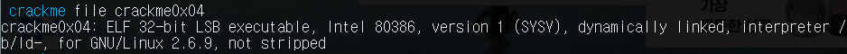
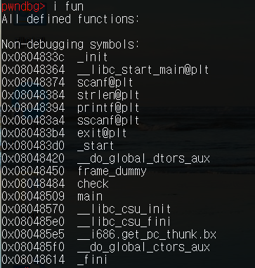
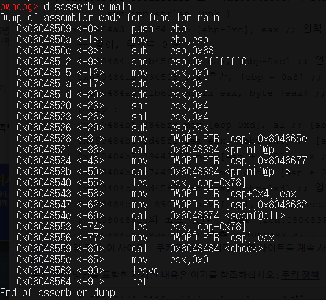

# HW-4
## crackme 4

1. file crackme4 : 32비트



---
gdb


2. i fun : 함수 체크





> main 함수 존재, b main


3. disassemble main




4. disassemble check
```assembly
   0x08048484 <+0>:     push   ebp      
   0x08048485 <+1>:     mov    ebp,esp
   0x08048487 <+3>:     sub    esp,0x28
   0x0804848a <+6>:     mov    DWORD PTR [ebp-0x8],0x0 ;총합으로 설정하기
   0x08048491 <+13>:    mov    DWORD PTR [ebp-0xc],0x0 ;카운터으로 설정하기

   0x08048498 <+20>:    mov    eax,DWORD PTR [ebp+0x8] ;입력 값('입력한 비밀번호')를 eax로 이동하기
   0x0804849b <+23>:    mov    DWORD PTR [esp],eax ;'입력한 비밀번호'를 esp(strlen 함수의 피라미터)로 이동하기
   0x0804849e <+26>:    call   0x8048384 <strlen@plt> ;strlen 함수 실행하기 -> eax에 '입력한 비밀번호'의 길이를 리턴하기
   0x080484a3 <+31>:    cmp    DWORD PTR [ebp-0xc],eax ;카운터와 '입력한 비밀번호'의 길이를 비교하기
   0x080484a6 <+34>:    jae    0x80484fb <check+119> ;카운터 >= '입력한 비밀번호'의 길이 라면 check+119로 이동하기
   0x080484a8 <+36>:    mov    eax,DWORD PTR [ebp-0xc] ;카운터의 값을 eax로 이동하기
   0x080484ab <+39>:    add    eax,DWORD PTR [ebp+0x8] ;eax에 '입력한 비밀번호'의 주소를 더하기
   0x080484ae <+42>:    movzx  eax,BYTE PTR [eax] ;eax에 들어있는 주소가 가르키는 값(입력한 비밀번호[카운터])을 eax에 저장하기
   0x080484b1 <+45>:    mov    BYTE PTR [ebp-0xd],al ;al 값(입력한 비밀번호[카운터])을 [ebp-0xd]로 이동하기 
   0x080484b4 <+48>:    lea    eax,[ebp-0x4] ;[ebp-0x4]의 주소를 eax로 이동하기
   0x080484b7 <+51>:    mov    DWORD PTR [esp+0x8],eax ;eax 값을 [esp+0x8](sscanf 함수의 피라미터->숫자로 변환될 값)로 이동하기
   0x080484bb <+55>:    mov    DWORD PTR [esp+0x4],0x8048638 ;"%d"를 [esp+0x4](sscanf 함수의 피라미터)로 이동하기
   0x080484c3 <+63>:    lea    eax,[ebp-0xd] ;[ebp-0xd]의 주소(입력한 비밀번호[카운터])를 eax로 이동하기
   0x080484c6 <+66>:    mov    DWORD PTR [esp],eax ;eax 값을 esp(sscanf 함수의 피라미터->바꿀 문자열의 주소)로 이동하기
   0x080484c9 <+69>:    call   0x80483a4 <sscanf@plt> ;sscanf 함수 실행하기 -> eax에 1을 리턴하기
   0x080484ce <+74>:    mov    edx,DWORD PTR [ebp-0x4] ; sscanf 함수에서 숫자로 변환된 값을 edx로 이동하기
   0x080484d1 <+77>:    lea    eax,[ebp-0x8] ;총합의 주소를 eax로 이동하기
   0x080484d4 <+80>:    add    DWORD PTR [eax],edx ;총합에 숫자로 변환된 값을 더하기
   0x080484d6 <+82>:    cmp    DWORD PTR [ebp-0x8],0xf ;총합과 0xf(15)를 비교하기
   0x080484da <+86>:    jne    0x80484f4 <check+112> ;총합과 0xf이 다르면 check+112로 이동하기
   0x080484dc <+88>:    mov    DWORD PTR [esp],0x804863b ;"Password OK!\n"를 DWORD PTR [esp]에 이동하기(prinf의 피라미터)
   0x080484e3 <+95>:    call   0x8048394 <printf@plt> ;prinf 함수 -> "Password OK!" 출력하기
   0x080484e8 <+100>:   mov    DWORD PTR [esp],0x0 ;0x0을 DWORD PTR [esp]에 이동하기(exit의 피라미터)
   0x080484ef <+107>:   call   0x80483b4 <exit@plt> ;exit 함수 -> 나가기
   0x080484f4 <+112>:   lea    eax,[ebp-0xc] ;카운터 주소를 eax에 이동하기
   0x080484f7 <+115>:   inc    DWORD PTR [eax] ;카운터 값을 1씩 증가하기
   0x080484f9 <+117>:   jmp    0x8048498 <check+20> ;check+20으로 이동하기
   0x080484fb <+119>:   mov    DWORD PTR [esp],0x8048649 ;"Password Incorreck!\n"를 DWORD PTR[esp]에 이동하기(prinf의 피라미터)
   0x08048502 <+126>:   call   0x8048394 <printf@plt> ;printf 함수 -> "Password Incorreck!" 출력하기
   0x08048507 <+131>:   leave ; 나가기
   0x08048508 <+132>:   ret ; 리턴하기
   ```

이를 통해 crackme4의 비밀번호는 '각 자리의 숫자의 총합이 15인 수'라는 것을 알 수 있다.