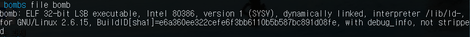
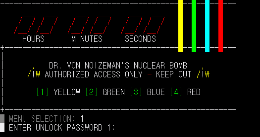
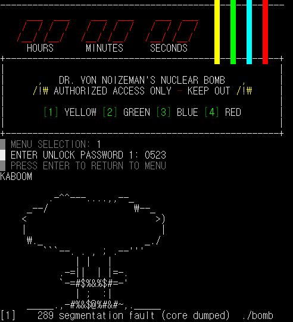
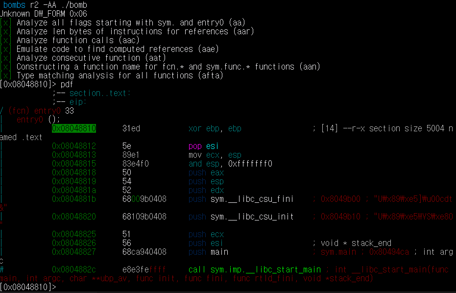
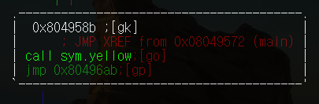
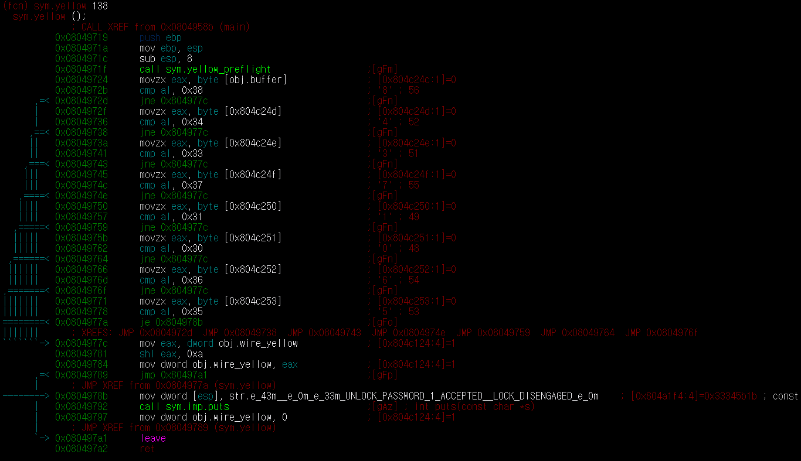
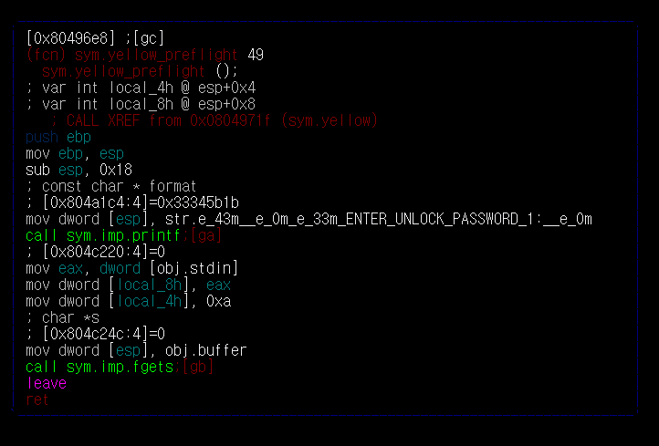
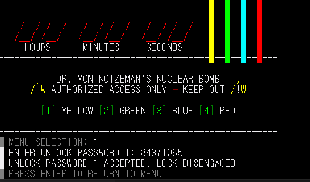
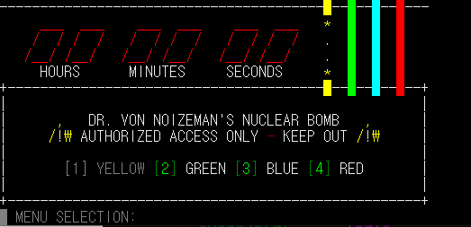
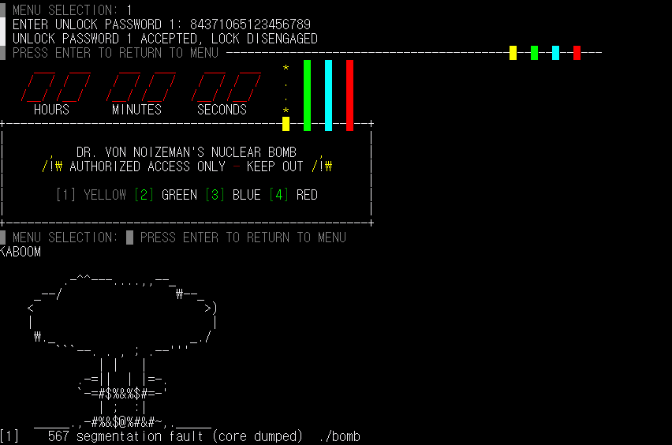

# HW5

## bomb 노란선 제거

먼저 파일을 확인합니다.

 

그 결과 32bit라는 것을 확인했습니다.

파일을 실행시킨 후, 노란색을 제거하기 위해 1을 입력하면 비밀번호를 입력하게 됩니다.

먼저 아무 숫자나 넣어보았습니다.

~~당연히~~ 비밀번호가 틀려 폭탄이 터지게 됩니다.

이제, 파일을 `radare2`로 분석해보겠습니다. `pdf`를 해보았더니, main 이 있습니다.

`s main` 로 main으로 이동한 후 `pdf `하고 `VV`로 보면 'sym.yello' 함수를 찾을 수 있었습니다. 

노란선을 제거해야 하기 때문에 이 함수에서 비밀번호를 체크한다고 예상됩니다. 따라서 이 함수로 들어가서 `pdf`로 확인해보겠습니다..

코드를 확인해보면 [obj.butter]의 주소값에서 부터 한 바이트씩 비교를 한다는 것을 알 수 있습니다. 따라서 비밀번호를 *84371065*라고  예상을 해보고 [obj.butter]가 무엇을 의미하는지 알아보기 위해 'sym.yellow_preflight 함수로 이동해보겠습니다.'

이 코드들을 보면 먼저 "ENTER_UNLOOK_PASSWORD_!:"을 'sym.imp.printf' 함수를 실행하여 출력합니다.

이후 입력을 받고, 그 값을 [obj.buffer]로 이동시키는 과정을 'sym.imp.fgets' 함수을 통해 실행합니다.

이를 통해 [obg.buffer]은 우리가 입력한 비밀번호라는 것을 알 수 있습니다. 즉, 우리가 입력한 비밀번호를 바이트 단위씩 8번 비교한다는 것을 알게되었습니다.

그래서 다시 bomb를 실행시켜 *84371065*를 비밀번호에 입력해보았습니다.

예상대로 폭탄은 제거되었습니다. 제거된 후, 다시 엔터를 누르면 노란색 선이 제거된 폭탄이 보입니다.

이때, 입력된 비밀번호를 총 8번 비교한다면, 만약 앞 8자리는 비밀번호와 일치하게 입력한후 9자리부터 임의의 숫자를 넣는다면 어떻게 될지 궁금해졌습니다. 그래서 84371065123456789를 넣어본 결과 

이런식으로 비밀번호가 맞았다는 글씨도 출력이 되면서 메뉴창이 이상하게 뜨고, 그 후 폭탄이 터진 것이 출력됩니다. 마지막으로 'segmentation fault'가 출력되었습니다.

앞에 8글자는 일치하기 때문에 비밀번호가 맞았다는 글씨는 출력이 되었지만, 입력한 데이터가 개발자의 예상(?)보다 더 커서 생긴 ~~신기한~~ 현상인 것 같습니다.

**결론 : 노란색 선을 제거하기 위한 비밀번호는 '*84371065*'이다.**