# HW-6
## bof3

먼저 `bat bof3.c`로 bof3 파일을 확인해보겠습니다.

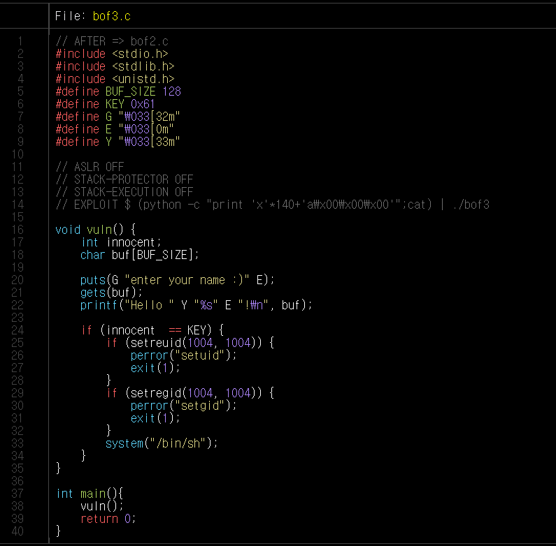

'system("/bin/sh") 함수'를 실행시켜야지, bof4의 권한으로 쉘이 열리고 bof4의 비밀번호가 적혀있는 bof4.pw를 읽을 수 있습니다. 

이를 위해서는 변수 Innocent와 KEY의 값이 같아야 합니다. 이때 KEY는 0x61 즉, a라는 것을 알 수 있습니다.

이후 `gdb bof3`로 buf와 Innocent의 거리를 알아보겠습니다.

'vuln 함수'에 브레이크를 걸고 프로그램을 실행시키다보면 위에서 확인한 것처럼 'gets 함수'가 나옵니다. 'gets 함수'의 인자가 buf이기 때문에 이의 위치을 확인합니다.

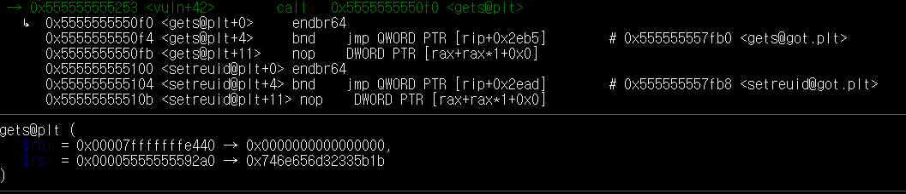

buf의 위치는 위 사진에서 rdi의 값이고 *0x00007fffffffe40* 입니다.

그 다음으로 Innocent와 KEY(0x61)를 비교해주는 cmp를 보면, Innocent의 위치를 확인할 수 있습니다.

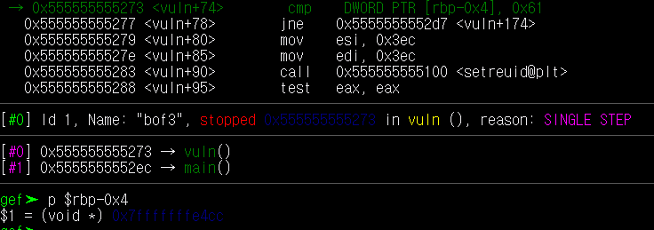

여기서 0x61과 [rbp-0x4]의 값을 비교하므로 Innocent의 주솟값은 [rbp-0x4]라는 것을 알 수 있고, 이는 *0x7fffffffe4cc* 입니다.

이제 이 값들을 빼주면 buf와 Innocent의 거리가 나옵니다.

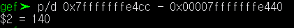

둘의 거리는 **140**이라는 것을 알았습니다.

이제, **140** 만큼의 데이터로 buf를 채워주고 그다음 Innocent 부분을 KEY인 0x61로 채워줍니다. 이때, 0x61를 little Endian으로 나타내면 *a\x00\x00\x00* 입니다.

따라서 *python -c "print 'x'*140 + 'a\x00\x00\x00'"* 를 입력하면 됩니다.

bof3에서는 파일을 실행하면, 'gets 함수'를 통해 입력을 받아줍니다. 따라서 *python -c "print 'x'*140 + 'a\x00\x00\x00'" | ./bof3* 로 파일을 실행하야 하는데, 이렇게만 한다면 바로 쉘이 종료되기 때문에 
```
(python -c "print 'x'*140 + 'a\x00\x00\x00'";cat) | ./bof3 
```
로 실행시킵니다. 그 다음 `cat bof4.pw` 를 통해 bof4의 비밀번호를 알아낼 수 있습니다.

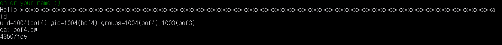

비밀번호는 **43b07fce** 입니다.

---

## bof4

먼저 `bat bof4.c`로 bof4 파일을 확인해보겠습니다.

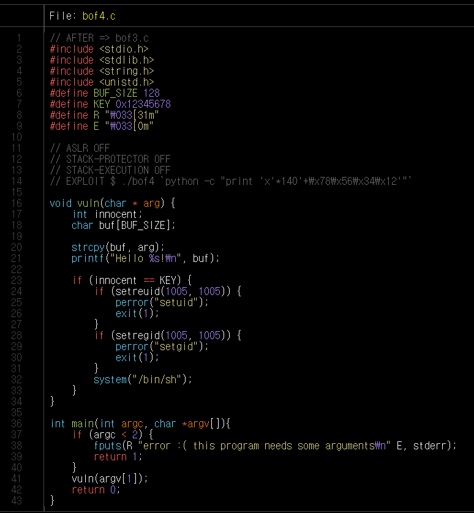

'system("/bin/sh") 함수'를 실행시켜야지, bof5의 권한으로 쉘이 열리고 bof5의 비밀번호가 적혀있는 bof5.pw를 읽을 수 있습니다. 

이를 위해서는 변수 Innocent와 KEY의 값이 같아야 합니다. 이때 KEY는 0x12345678라는 것을 알 수 있습니다.

이후 `gdb bof4`로 buf와 Innocent의 거리를 알아보겠습니다.

'main 함수'에 브레이크를 걸고 프로그램을 실행시키다보면 main에서 인자가 주어줘야하기 때문에 실행시킬 때 인자를 입력해주지 않으면, argc가 1이여서 'vuln 함수'로 가기 전 에러가 뜨게 됩니다. 따라서 'gdb'에서 `r`로 프로그램을 실행시킬 때 `r 123`같이 인자를 넣어주어야 합니다.

이후 'strcopy 함수'가 나오고 이 함수의 첫 번째 인자가 buf이므로 이 위치를 확인해보겠습니다.

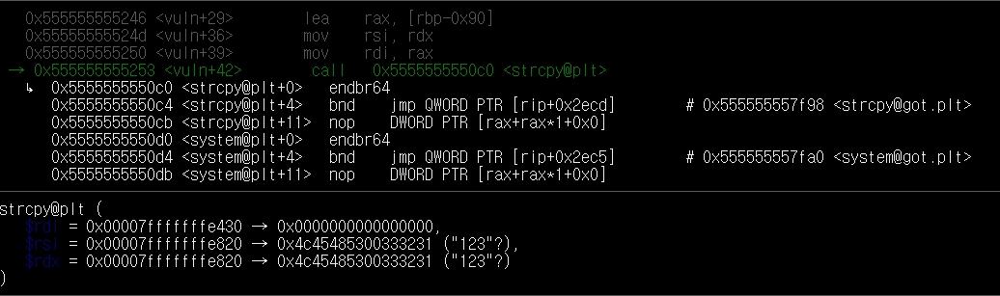

buf의 위치는 위 사진에서 rdi의 값이고 *0x00007fffffffe430* 입니다.

그 다음으로 Innocent와 KEY(0x12345678)를 비교해주는 cmp를 보면, Innocent의 위치를 확인할 수 있습니다.

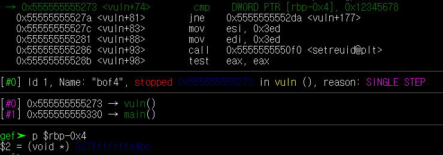

여기서 0x61과 [rbp-0x4]의 값을 비교하므로 Innocent의 주솟값은 [rbp-0x4]라는 것을 알 수 있고, 이는 *0x7fffffffe4bc* 입니다.

이제 이 값들을 빼주면 buf와 Innocent의 거리가 나옵니다.


둘의 거리는 **140**이라는 것을 알았습니다.

이제, **140** 만큼의 데이터로 buf를 채워주고 그다음 Innocent 부분을 KEY인 0x12345678로 채워줍니다. 이때, 0x12345678를 little Endian으로 나타내면 *\x78\x56\x34\x12* 입니다.

따라서 *python -c "print 'x'*140 + 'x78\x56\x34\x12'"* 를 입력하면 됩니다.

bof4에서는 파일을 실행할 때, 인자를 주어줘야 합니다. 따라서 
```
 ./bof4 `python -c "print 'x'*140 + 'xxxx'"` 
 ```
 로 실행시킵니다. 그 다음 `cat bof5.pw` 를 통해 bof5의 비밀번호를 알아낼 수 있습니다.

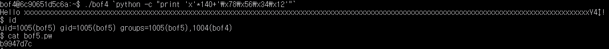

비밀번호는 **b9947d7c** 입니다.

---

## bof5

먼저 `bat bof5.c`로 bof5 파일을 확인해보겠습니다.

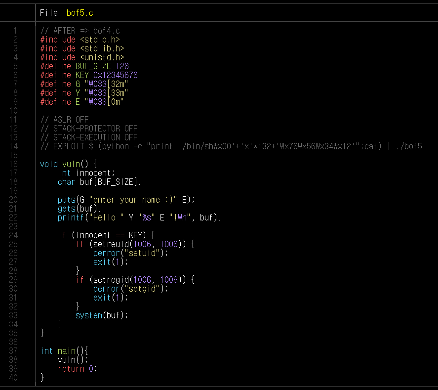

'system("/bin/sh") 함수'를 실행시켜야지, bof6의 권한으로 쉘이 열리고 bof6의 비밀번호가 적혀있는 bof6.pw를 읽을 수 있습니다. 
> 하지만 여기선 'system(buf)'라고 되어있습니다. 이를 위의 경우처럼 실행하기 위해서는 buf에 */bin/sh\x00*를 입력한 후, 다른 것으로 채워줘야 합니다.

이를 위해서는 변수 Innocent와 KEY의 값이 같아야 합니다. 이때 KEY는 0x12345678라는 것을 알 수 있습니다.

이후 `gdb bof5`로 buf와 Innocent의 거리를 알아보겠습니다.

'vuln 함수'에 브레이크를 걸고 프로그램을 실행시키다보면 위에서 확인한 것처럼 'gets 함수'가 나옵니다. 'gets 함수'의 인자가 buf이기 때문에 이의 위치을 확인합니다.

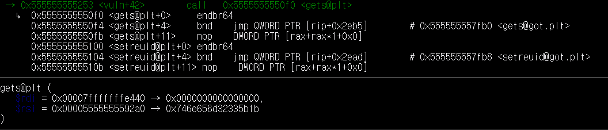

buf의 위치는 위 사진에서 rdi의 값이고 *0x00007fffffffe440* 입니다.

그 다음으로 Innocent와 KEY를 비교해주는 cmp를 보면, Innocent의 위치를 확인할 수 있습니다.

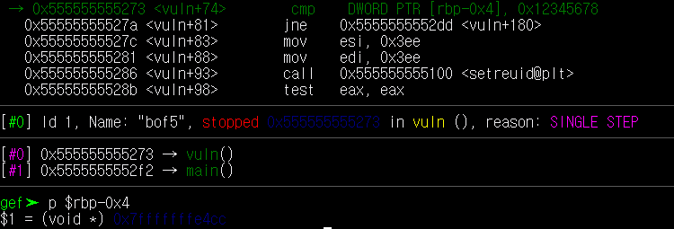

여기서 0x61과 [rbp-0x4]의 값을 비교하므로 Innocent의 주솟값은 [rbp-0x4]라는 것을 알 수 있고, 이는 *0x7fffffffe4cc* 입니다.

이제 이 값들을 빼주면 buf와 Innocent의 거리가 나옵니다.

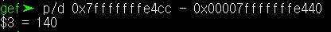

둘의 거리는 **140**이라는 것을 알았습니다.

이제, **140** 만큼의 데이터로 buf를 채워주고 그다음 Innocent 부분을 KEY인 0x12345678로 채워줍니다. 이때, 0x12345678를 little Endian으로 나타내면 *\x78\x56\x34\x12* 입니다.

따라서 *python -c "print '/bin/sh\x00'+'x'*132+'\x78\x56\x34\x12'"*를 입력하면 됩니다.

bof5에서는 파일을 실행하면, 'gets 함수'를 통해 입력을 받아줍니다. 따라서 *python -c "print '/bin/sh\x00'+'x'*132+'\x78\x56\x34\x12'" | ./bof5* 로 파일을 실행하야 하는데, 이렇게만 한다면 바로 쉘이 종료되기 때문에 
```
(python -c "print '/bin/sh\x00'+'x'*132+'\x78\x56\x34\x12'";cat) | ./bof5 
```
로 실행시킵니다. 그 다음 `cat bof6.pw` 를 통해 bof6의 비밀번호를 알아낼 수 있습니다.

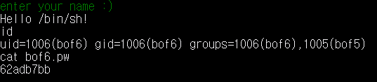

비밀번호는 **62adb7bb** 입니다.
