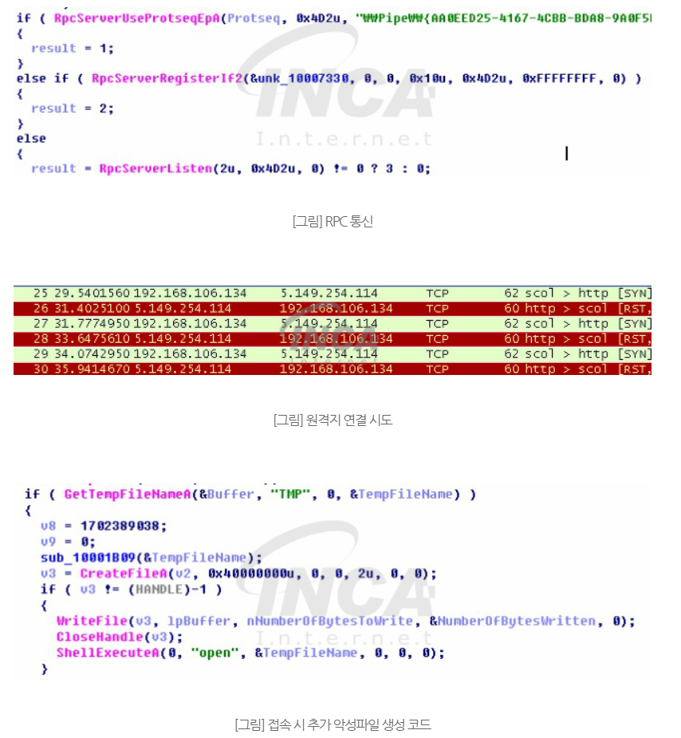
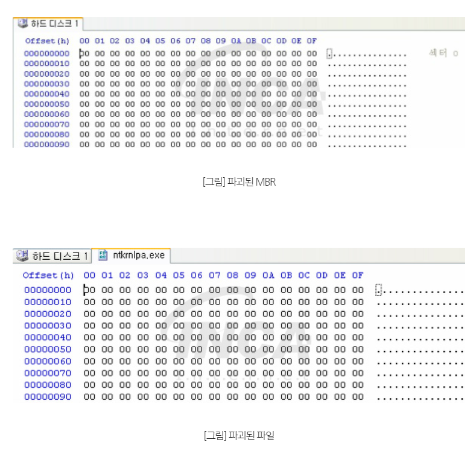

# 우크라이나 정전 사건
2015년, 2016년 12월 우크라이나와 전쟁 중인 러시아 정부의 해킹 단체인 샌드웜(*Sandworm*)에서 우크라이나의 전령망에 두 번의 사이버 공격을 가했습니다. 이로 인해 우크라이나 시민들이 정전을 겪었습니다.
- 첫 번째 2015년의 정전은 일련의 악성코드에 의해 발생했고, 이 악성코드들 중에는 **블랙 에너지(Black Energy)** 가 포함되었습니다. 블랙 에너지는 해커들이 컴퓨터 안에 있는 각종 공인 인증서와 증명서를 훔치고 회로 차단기를 수동으로 끌 수 있도록 하였습니다.
- 두 번째 2016년의 정전은 크래스 오버라이드(*Crash Override*) 또는 인더스트로이어(*Industroyer*)로 보다 진화된 악성코드로 전기 공금소를 공격했습니다. 이 공격에서 해커들은 교모한 방법을 사용한 첫 번째 전력 망 공격에서와는 달리 전력 흐름을 제어하는 시스템을 직접 조작하였습니다.
---
## **블랙 에너지(Black Energy)**
블랙 에너지는 하나의 악성 파일이 아닌, 침투-정보수집-확산-공격-파괴의 절차를 가진 APT공격 전체를 지칭하는 것으로, 다양한 목적을 가진 악성파일들과 악성행위들을 모두 일컫는 말입니다.
> ART 공격이란 Advanced Persistent Threat의 약자로 지능적 지속 위협이라는 뜻입니다. 즉, 지능적인 방법을 사용하여 지속적으로 특정 대상을 공격하는 것입니다. APT공격은 과거의 불특정 다수를 노렸던 사이버 공격들과 달리 하나의 대상을 정해서 성공할 때까지 공격을 멈추지 않는 것이 특징입니다.
### 블랙 에너지의 시발점이 된 엑셀 문서 파일
> 파일명 : BlackEnergy.xls

> 파일크기 : 734.724 btye

> 진단명 : Trojan-Dropper/X97M.BlackEnergy

> 악성동작 : xls매크로

#### 유포 경로
MS 오피스 문서에 포함된 매크로 악성코드가 공격의 시작이라고 알려져 있습니다. 또한, 스피어 피싱 기법을 사용하여 사용자의 흥미를 끄는 이메일 첨부파일을 통해 악성파일 실행을 유도합니다. 이렇게 감염된 PC는 추가 악성 모듈 다운로드, 백도어 등의 동작을 수행해 감염 PC 네트워크에 대한 공격의 발판으로 이용됩니다.
#### 실행과정
1. 악성 xls 파일에는 악성 코드를 생성 및 실행하는 매크로가 등록되어 있습니다. xls파일의 매크로가 실행되기 위해선 사용자가 직접 매크로를 활성화 해야합니다. 매크로를 허용하지 않는다면 악성동작이 수행되지 않지만, 피해자가 관심을 가질 만한 내용으로 위장한 파일이거나, 매크로 사용이 빈번한 사용자라면 매크로 실행이 허용될 수 있습니다. 
2. 스피어 피싱 이메일에 포함된 오피스 파일은 매크로 악성코드와 유사한 형태의 동작을 수행합니다. xls문서 파일에서 실행되는 악성코드는 최종적으로 원격지 서버에 접속을 시도하며, 연결에 성공 시 추가 악성코드를 다운로드 합니다. 
3. 매크로로 생성된파일 *vba_macro.exe*은 또 다른 악성파일 *FONTCACHE.DAT*을 생성 및 윈도우 정상 프로세스 *rundll32.exe*를 이용하여 자동실행 등록합니다. 이후 악성동작은 이 파일을 이용해 이뤄집니다.
### 악성 동작
#### 원격지 연결
APT 공격은 장기간에 걸쳐 지속적으로 이뤄지는 만큼 악성코드의 업데이트 및 네트워크, PC 정보 수집에 관한 동작이 다수를 이룹니다. *FONTCACHE.DAT* 또한 이러한 역학을 하는 모듈로써, 원격 연결을 이용해 해커가 언제든 감염 PC에 접근할 수 있기 때문에 공격 대상 네트워크에 대한 지속적인 위협을 가할 수 있습니다.
실행중인 *FONTCACHE.DAT*는 RPC통신을 이용하여 원격지와 연결을 시도합니다. 

#### MBR파괴
> MBR(*Master Boot Record*)이란 파티션 된 저장장치(하드 디스크, 이동식 저장장치, USB메모리 등)의 가장 앞 부분에 쓰여있는, 저장장치 이용 시 반드시 필요한 정보입니다. 

MBR에 있는 PC부팅에 반드시 필요한 여러 정보가 손상되면 저장장치를 읽을 수 없게 되어 대표적으로 PC부팅 실패 등 여러 이상이 발생합니다.

